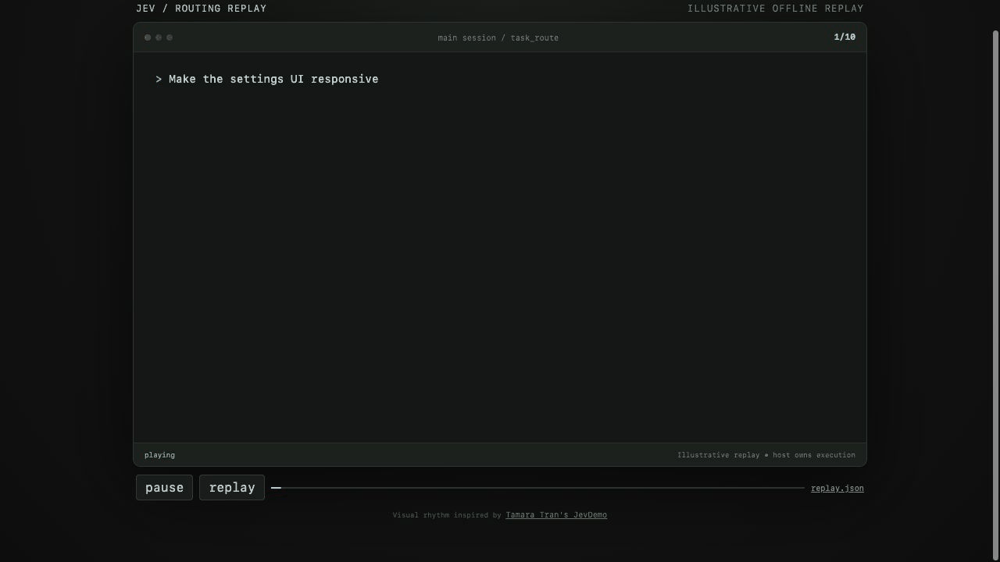

# jevbrain

Jevbrain selects a registered profile with a role, model, effort, and capability set. The main session decides when to delegate, Jev selects an eligible profile, and the host executes and verifies the work.



This short replay uses curated illustrative data. It shows the routing contract only. It does not call Jev or launch a worker.

## Install from source

Requirements: Bun 1.3.8 or newer and a Codex CLI build with plugin support.

```bash
git clone https://github.com/devos-ing/jevbrain.git
cd jevbrain
bun install --frozen-lockfile
bun run plugin:stage
codex plugin add jevbrain@personal
```

Start a new Codex task after installation so the MCP tool and companion skill load.

The staged plugin uses disabled defaults. The bundled profiles are enabled in the registry but all have `declaredAvailable: false`. The policy keeps provider access and egress disabled. A new installation therefore returns no profiles from `task_route_options` and makes no Jev call.

### Configure availability

Keep host-owned configuration outside the staged plugin. Copy the example files, then set the profiles that your host can actually launch to `declaredAvailable: true`.

```bash
mkdir -p ~/.config/jevbrain
cp -n examples/routing-registry.json ~/.config/jevbrain/registry.json
cp -n examples/routing-policy.json ~/.config/jevbrain/policy.json
export JEVBRAIN_REGISTRY="$HOME/.config/jevbrain/registry.json"
export JEVBRAIN_POLICY="$HOME/.config/jevbrain/policy.json"
```

Set `providerEnabled` and `egressEnabled` to `true` only when you intend to send routing briefs to Jev. Supply `TYPESAFE_API_KEY` through the process environment. For the CLI, launch `codex` from the configured shell. A desktop app must inherit these variables when it starts; restarting an already running app does not add them. See the [plugin installation guide](docs/codex-plugin.md) for details. Never put credentials in the registry, policy, or MCP configuration. Availability tells Jevbrain what the host can launch; it does not launch or grant access to that runtime.

See [the plugin installation guide](docs/codex-plugin.md) for staged paths and updates. If you want a standalone MCP connection, use [the Codex example](examples/codex-mcp.toml) or [the Claude Code example](examples/claude-code-mcp.json). Both contain path placeholders.

## Usage

Call `task_route_options` first. It takes an empty object and returns enabled, available, policy-allowed profile metadata without contacting Jev.

Then call `task_route` with the approved delegation brief. Use [the routing request example](examples/routing-request.json) as the request shape.

For example, ask Codex:

```text
List the available profiles, then route this frontend fix to an eligible profile. Preserve an abstention if no profile qualifies. Return the selected role, model, and effort.
```

`candidateProfileIds` can narrow the trusted registry. It cannot add a profile, command, tool, data source, or permission. If context is incomplete, no eligible profile remains, provider access is disabled, or Jev abstains, the router returns an explicit non-selection result.

## Development

Run the focused project checks with Bun:

```bash
bun run typecheck
bun run lint
bun run test
```

To run the visual demo locally:

```bash
cd demos/routing-replay
bun install --frozen-lockfile
bun run build
bun run preview
```

Open `http://127.0.0.1:4430`.

From the repository root, replay recorded routing observations without a provider request or worker launch:

```bash
bun run bench routing-replay \
  --suite bench/routing-v1/suite.json \
  --out /tmp/jevbrain-routing-replay
```

See [the routing replay demo](demos/routing-replay/README.md) for the browser version.

Read [the routing contract](docs/routing-first.md) for eligibility and result states, [the context handoff rules](docs/context-handoff.md) for source manifests and grants, and [the benchmark guide](docs/benchmark.md) for offline evaluation details.

The demo's visual rhythm is inspired by [Tamara Tran's JevDemo on X](https://x.com/tamarajtran/status/2100694549362553153) and the MIT-licensed [fast-jev-compaction demo](https://github.com/tamaratran/fast-jev-compaction/tree/main/demo/JevDemo).
